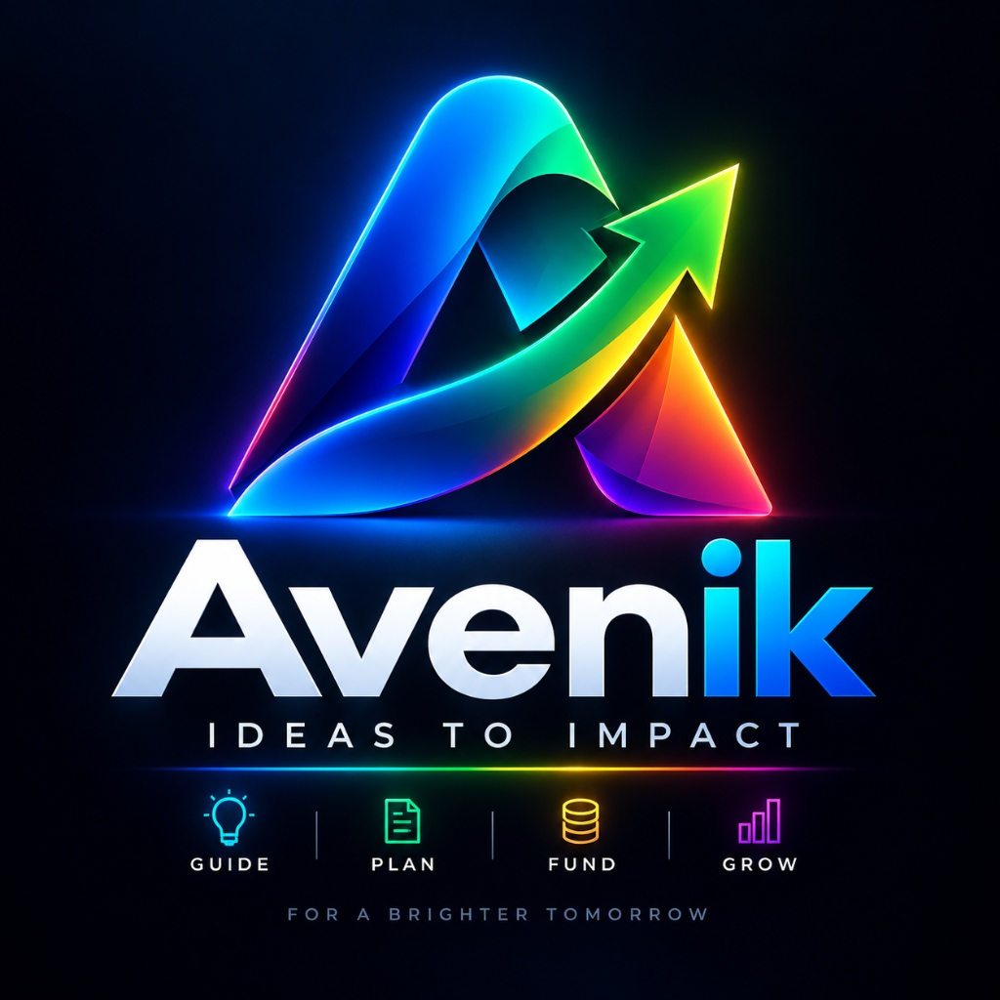

  
  <h1>🚀 AVENIK</h1>
  
<b>India's Comprehensive AI-Driven Startup Ecosystem Platform</b>

 

## 🏆 Project Progress

**Phases 1–33 Completed**
The repository is an execution-stable baseline with over 80 database models mapped to the ecosystem. Authentication, authorization, digital twin foundations, and context isolation are fully integrated on the backend. 

*Development will continue updating from Phase 34 onwards.*

---

## 💻 Local Setup

1. Clone the repository and configure .env (Database and JWT secrets).
2. Install dependencies:
   \\\ash
   cd frontend && npm install && cd ..
   cd backend && npm install && cd ..
   \\\
3. Run backend database setup:
   \\\ash
   cd backend
   npx prisma db push
   npx prisma generate
   \\\
4. Start both servers in separate terminals:
   \\\ash
   # Terminal 1
   cd frontend && npm run dev
   
   # Terminal 2
   cd backend && npm run dev
   \\\
5. Open [http://localhost:3000](http://localhost:3000)

---

  <b>Built with ❤️ to empower India's Entrepreneurs</b>

